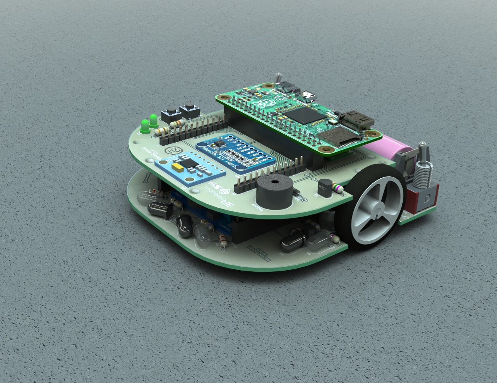

# **doogie_robot**

The **doogie_robot** stack provides a [ROS] interface communication to Doogie Mouse **hardware** plataform. For tutorials, please check [doogie_robot/Tutorials] on wiki.

**Keywords:** Micromouse, Gazebo, ROS

**Author: [Mateus Meneses] 
Affiliation: [BIR - Brazilian Institute of Robotics] 
Maintainer: Mateus Meneses, mateusmenezes95@gmail.com **

### Supported Versions

- **Kinetic**: Built and tested under [ROS] Kinetic and Ubuntu 16.04

<!--  TODO -->

### Dependencies 
- [doogie_base] : ROS packages stack with all common packages for working with Doogie Mouse

   

 

 

# **Table of Contents**
- [**doogie_robot**](#doogierobot)
    - [Supported Versions](#supported-versions)
    - [Dependencies](#dependencies)
- [**Table of Contents**](#table-of-contents)
- [**File System**](#file-system)
- [**Installation**](#installation)
    - [Building from Source:](#building-from-source)
  - [Example of Usage](#example-of-usage)
    - [Launch Doogie Mouse at Gazebo:](#launch-doogie-mouse-at-gazebo)
- [**Purpose of the Project**](#purpose-of-the-project)
- [**License**](#license)
- [**Bugs & Feature Requests**](#bugs--feature-requests)

# **File System**

- [doogie_bringup] : Package with launch files to bringup Doogie Mouse robot controllers.
- [doogie_drivers]: Cotains drivers used by Doogie Mouse robot **URDF**.

 

# **Installation**

<!-- ### 1. Installation from Packages:

TODO

    sudo apt-get install ros-indigo-...

or you could also build this repository from source. -->

### Building from Source:

Attention, if you haven't installed [ROS] yet, please check [Ubuntu install of ROS Kinetic](http://wiki.ros.org/kinetic/Installation/Ubuntu). Desktop-Full Install is the recommended one in order to work with this repository.    

**Building:**

First, lets create a catkin workspace.

    mkdir -p ~/doogie_ws/src

**doogie_robot** depends on [doogie_base] stack. So let's clone it inside our workspace source and install it.

	cd ~/doogie_ws/src
	git clone http://github.com/doogie-mouse/doogie_base.git
    cd ..
    rosdep install --from-paths src --ignore-src -r -y

Then, clone **doogie_robot** also in your workspace source.
        
    git clone http://github.com/doogie-mouse/doogie_robot.git

Now, just build your catkin workspace.

    cd ~/doogie_ws
    catkin_make

Don't forget to source your workspace before using it.
    
    source devel/setup.bash

## Example of Usage

### Launch Doogie Mouse at Gazebo:

Just launch the robot.launch

	roslaunch doogie_bringup robot_bringup.launch

 

# **Purpose of the Project**

Doogie Mouse platform was originally developed in 2019 as an undergraduate thesis (Theoprax methodoly) at Centro Universitário SENAI CIMATEC in partnership with Brazillian Institute of Robotics, for teaching principles of artificial intelligence using high level framework for writing and reusing robot software.

It's a [open source project](/LICENSE) and expects modifications and contributions from it's users. 

 

# **License**

Doogie Mouse Simulator source code is released under a [Apache 2.0](/LICENSE).

 

# **Bugs & Feature Requests**

Please report bugs and request features using the [Issue Tracker].

[BIR - Brazilian Institute of Robotics]: https://github.com/Brazilian-Institute-of-Robotics
[Mateus Meneses]: https://github.com/doogie-mouse/doogie_robot/commits?author=mateusmenezes95
[doogie_base]: http://github.com/doogie-mouse/doogie_base.git
[doogie_gazebo]: doogie_gazebo
[doogie_gazebo/Tutorials]: http://github.com/doogie-mouse/doogie_robot/wiki/doogie_gazebo
[Issue Tracker]: http://github.com/doogie-mouse/doogie_robot/issues
[ROS]: http://www.ros.org